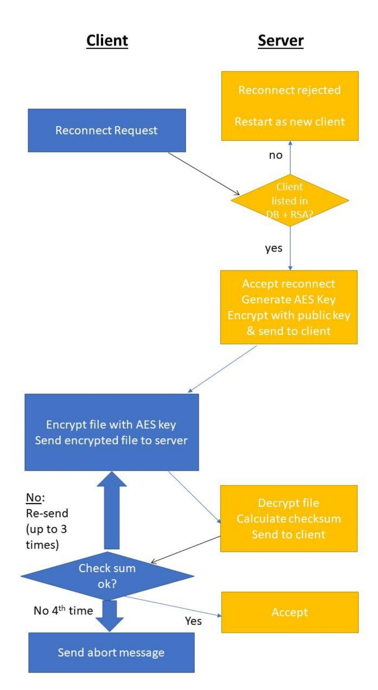
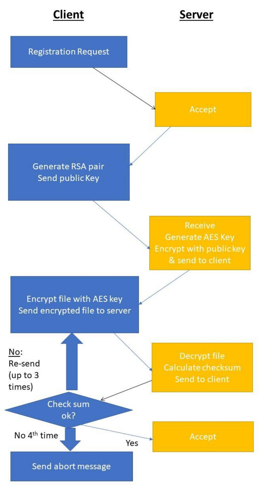

# Encrypted File Transfer System

The Encrypted File Transfer System was developed to ensure secure transmission of files between clients and a server. It's structured as a client-server architecture with a primary focus on maintaining data confidentiality and integrity during file exchange.

This implementation includes a partially secure file transfer protocol intended for smaller file sizes. The server is written in Python 3.9, the client in C++11, and MySQL manages the database.

For detailed project specifications in Hebrew, refer to the [project_specifications.pdf](readme/projectSpec.pdf).

This project was completed as the final submission for the course Defensive System Programming (20937) at the Open University of Israel.

## Table of Contents
- [Requirements](#requirements)
- [Getting Started](#getting-started)
- [Features](#features)
- [Communication Protocol](#communication-protocol)
- [Encryption](#encryption)
- [Payload Content](#payload-content)
- [Vulnerabilities and Weaknesses](#vulnerabilities-and-weaknesses)

## Requirements

To effectively utilize and compile the Encrypted File Transfer System, ensure the following software and libraries are installed:

### For the Python Server:

- **Python**: Python 3.9 or a compatible version is necessary.
- **Crypto.Cipher**: Use the `pycryptodome` library for encryption. Install it via pip: `pip install pycryptodome`.

### For the C++ Client:

- **Boost C++ Libraries (Version 1.81.0)**: For network handling in this project, download and install Boost from the official website: [Boost C++ Libraries (Version 1.81.0)](https://www.boost.org/users/history/version_1_81_0.html).
- **For the client it's better to work with VM ware to make sure that the make file will work you can setup the Boost library via this link: [https://www.youtube.com/watch?v=Y6wJrsMAlW8](https://www.youtube.com/watch?v=Y6wJrsMAlW8).
- **C++11**: A compatible C++11 compiler is required for the client. Verify you have an appropriate compiler installed.
- **Crypto++ (Version 8.7.0)**: Crypto++ is utilized for cryptographic operations. Download it from the official website: [Crypto++ Library (Version 8.7.0)](https://www.cryptopp.com/release870.html).

## Getting Started
Follow these steps to use the project:

1. Compile the client program in C++ with VM. (Follow this link) [https://youtu.be/wz34OKT7uaM](https://youtu.be/wz34OKT7uaM).
2. Ensure the `info.transfer` file is correctly configured with the server's IP address, port number, client name, and file path.
3. Ensure the Python server is running and set up for client communication.
4. Execute the client program to either register with the server (if not registered) or perform file transfer operations.

## Features

### Registration
- If the client lacks a registration file (`me.info`), it reads user information from the transfer file (`transfer.info`) and sends a registration request to the server.
- The server responds with a unique client ID, stored in `me.info`.

### Public Key Generation
- Clients generate RSA key pairs (public and private keys) and send their public key to the server.
- The server encrypts and sends an AES key back to the client using the received public key.

### File Transfer
- After receiving the AES key, the client decrypts it with its private RSA key and uses it to encrypt the file for transmission.
- The encrypted file is sent to the server, with both client and server verifying the file's integrity using CRC.

### Error Handling
- In the event of server errors, the client retries message transmission up to three times.
- Unsuccessful attempts result in the client exiting with a detailed "Fatal" message.

### Registration Request Flowchart

### Reconnect Process Flowchart

## Encryption

- **Symmetric Encryption**: Uses CBC-AES with a 128-bit key length for file content encryption. Initialization Vectors (IVs) are zero-filled.
- **Asymmetric Encryption**: RSA with a 1024-bit key length facilitates exchanging encryption keys between clients and the server.

## Payload Content

The payload content varies depending on the type of request/response. Each payload has a different structure.
you can see the Payload in the PDF [project_specifications.pdf](readme/projectSpec.pdf).

## Vulnerabilities and Weaknesses

| Vulnerability                   | Description                                                                                          | Solution                                                                                                                                                                                                                                                                 |
|---------------------------------|------------------------------------------------------------------------------------------------------|---------------------------------------------------------------------------------------------------------------------------------------------------------------------------------------------------------------------------------------------------------------------------|
| Unauthorized Database Access    | SQL injections may grant unauthorized access. Additionally, concurrent user actions on the database could lead to potential corruption and data loss. | Robust input validation and sanitization techniques have been implemented to counter SQL injection vulnerabilities. Mutual exclusive protection has been set up to safeguard against data corruption from concurrent actions.            |
| Directory Traversal Attack      | Toxic input might allow attackers to navigate server directories, potentially breaching sensitive information. | Mitigation involves strict input validation and sanitization processes, restricting user access to approved directories and files only.                                              |
| Buffer/Integer Overflow         | Vulnerabilities in C++ code could lead to buffer and integer overflow issues, potentially resulting in system compromises. | C++ code segments now incorporate stringent bounds checking and data validation logic. Secure libraries and best practices have been enforced to eliminate overflow vulnerabilities, such as adopting safer data structures like `string` instead of `char*`.                        |
| DDoS Attacks                    | Multiple requests from an attacker could lead to a server crash or system exhaustion, causing a significant disruption. | Mitigation strategies include limiting connections per IP and files per user. While these measures are basic, in a real scenario, services like Cloudflare would be integrated to protect against modern DDoS attacks.                    |
| Impersonation                   | Risks of Man-in-the-Middle attacks, potentially compromising communication integrity. | Although a semi-TLS protocol is implemented, the UUID is initially available to an attacker, allowing potential interception. In a real scenario, encryption of the UUID would be performed to prevent such attacks, enhancing overall security. |
| Server Crash                    | Deliberate attempts could crash the server, causing database corruption or complete system breakdown. | Vulnerabilities in server.py and server.db have been addressed to prevent crashes. Implementation of robust error handling and input validation has been crucial in avoiding system breakdown caused by unexpected inputs or situations.                                                                          |
